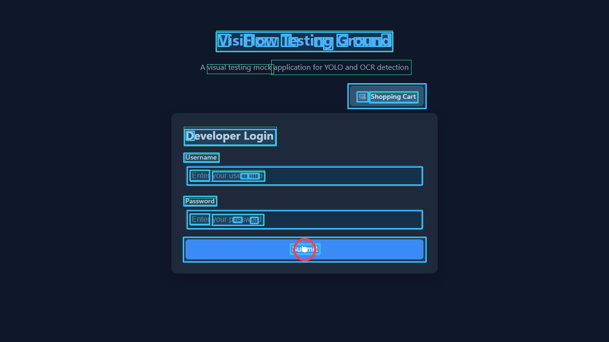

# 👁️ VisiFlow

[](https://pypi.org/project/visiflow/0.1.0/)
[](https://pypi.org/project/visiflow/0.1.0/)
[](https://www.npmjs.com/package/visiflow-js)
[](https://www.npmjs.com/package/visiflow-js)
[](https://opensource.org/licenses/MIT)
[]()

**VisiFlow** is a fast, 100% local, visual-driven E2E automation testing framework for **Python** and **Node.js (TypeScript/JavaScript)** ecosystem, built for **Playwright** and **Selenium**.

It challenges traditional web automation by throwing away fragile HTML DOM selectors (XPath, IDs, CSS classes) and replacing them with a local computer vision pipeline (YOLO + EasyOCR) to locate and interact with elements exactly how a human does.



---

## ⚡ Comparison: Why VisiFlow?

| Metric / Feature | Traditional DOM Selectors (XPath/CSS) | Cloud AI Automation (GPT-4o Vision API) | **VisiFlow (Our Local Core)** |
| :--- | :--- | :--- | :--- |
| **Maintenance Cost** | 🔴 Extremely High (Breaks on CSS/ID refactoring) | 🟢 Extremely Low (Zero selector maintenance) | 🟢 **Zero Maintenance (Visual-driven)** |
| **Execution Cost** | 🟢 $0 / Free | 🔴 Expensive ($0.01+ per screenshot query) | 🟢 **$0 / 100% Free Local Execution** |
| **Latency** | 🟢 < 10ms | 🔴 1.5s - 4.0s (Cloud latency & queues) | 🟡 **100ms - 250ms (Sub-second local CV)** |
| **Data Privacy** | 🟢 100% On-Premise | 🔴 Privacy Risks (Sends UI to external servers) | 🟢 **100% On-Premise & Private (Offline)** |
| **Ecosystem Support**| Python, JS/TS, Java | Vendor locked APIs | 🟢 **Python & Node.js (Playwright + Selenium)** |

---

## 📦 Installation

### Python Package ([PyPI v0.1.0](https://pypi.org/project/visiflow/0.1.0/))
```bash
pip install "visiflow[playwright,selenium]"
```

### Node.js Package ([npm v0.1.0](https://www.npmjs.com/package/visiflow-js))
```bash
npm install visiflow-js
```

---

## 💻 Quick Start

### 1. Python + Playwright

```python
from playwright.sync_api import sync_playwright
from visiflow import VisiPlaywrightPage, global_reporter

with sync_playwright() as p:
    browser = p.chromium.launch()
    page = browser.new_page()
    page.goto("https://example.com/login")

    # Wrap Playwright Page
    visipage = VisiPlaywrightPage(page)

    # Visual automation via natural language text labels!
    visipage.visual_fill("Username", "admin_user")
    visipage.visual_fill("Password", "secret_pass")
    visipage.visual_click("Submit")

    # Visual Assertions — verify what is on screen, not in the DOM
    visipage.visual_assert_visible("Welcome back!")
    visipage.visual_assert_not_visible("Invalid credentials")

    # Generate self-healing HTML report
    global_reporter.generate_html_report("visiflow_report.html")

    browser.close()
```

### 2. Python + Selenium

```python
from selenium import webdriver
from visiflow import VisiSeleniumDriver, global_reporter

driver = webdriver.Chrome()
driver.get("https://example.com/login")

# Wrap Selenium WebDriver
visi = VisiSeleniumDriver(driver)

# Visual automation — same API, works with Selenium too!
visi.visual_fill("Username", "admin_user")
visi.visual_fill("Password", "secret_pass")
visi.visual_click("Submit")

# Visual Assertions
visi.visual_assert_visible("Welcome back!")

# Generate self-healing HTML report
global_reporter.generate_html_report("visiflow_report.html")

driver.quit()
```

### 3. Node.js (JavaScript / TypeScript) + Playwright

First, start the local VisiFlow daemon server in your terminal:
```bash
visiflow server
```

Then in your JavaScript/TypeScript Playwright script:
```javascript
const { chromium } = require('playwright');
const { VisiPage } = require('visiflow-js');

(async () => {
    const browser = await chromium.launch();
    const page = await browser.newPage();
    await page.goto('https://example.com/login');

    // Wrap JS Playwright Page
    const visipage = new VisiPage(page);

    // Visual actions in JS!
    await visipage.visualFill('Username', 'js_developer');
    await visipage.visualFill('Password', 'secure_pass');
    await visipage.visualClick('Submit');

    // Visual Assertions in JS!
    await visipage.visualAssertVisible('Welcome back!');
    await visipage.visualAssertNotVisible('Invalid credentials');

    await browser.close();
})();
```

---

## ✅ Visual Assertions API

VisiFlow provides visual assertion methods that verify UI state **purely by what is rendered on screen** — no DOM selectors needed.

| Method | Description |
| :--- | :--- |
| `visual_assert_visible(text, timeout_ms)` | Assert that an element with the given text **is visible** on screen. Raises `AssertionError` on timeout. |
| `visual_assert_not_visible(text, timeout_ms)` | Assert that an element with the given text **is NOT visible** on screen. Raises `AssertionError` if still found. |
| `visual_wait_for(text, timeout_ms)` | Wait for an element to become visually present. Returns `True` when found. |

**Python Example:**
```python
# After clicking "Delete Account"
visipage.visual_assert_not_visible("My Profile")       # profile section should disappear
visipage.visual_assert_visible("Account deleted")       # success message should appear
```

**Node.js Example:**
```javascript
await visipage.visualAssertVisible('Dashboard');
await visipage.visualAssertNotVisible('Loading...');
```

---

## 📊 Self-Healing HTML Test Reports

VisiFlow automatically records every visual action (click, fill, assert) with before/after screenshots and OCR match scores. When the engine uses **fuzzy matching** to recover from a minor text change (e.g., a button label changed from `"Sign In"` to `"Log In"`), it flags the step as **"Self-Healed"** in the report.

### Generate a Report

```python
from visiflow import global_reporter

# After running your test steps...
global_reporter.generate_html_report("visiflow_report.html")
```

The report is a **fully self-contained HTML file** (all screenshots embedded as Base64) that you can open in any browser. It includes:

- **Dashboard Metrics**: Total steps, success/fail/healed counts, and total duration.
- **Step-by-Step Timeline**: Each action with its OCR match score, status badge, and duration.
- **Self-Healing Log**: When fuzzy matching was used, the report shows exactly what text was queried vs. what was matched and the similarity score.
- **Before/After Screenshots**: Visual comparison of the page state before and after each action.

---

## ⏺️ No-Code Script Recorder (Web Playground)

VisiFlow's built-in Web Playground includes a **Script Recorder** that lets you generate test scripts without writing any code.

### How to Use

1. Launch the Web Playground:
   ```bash
   visiflow ui
   ```

2. Upload or drag & drop a screenshot of your web application.

3. Toggle **"Enable Recording"** in the Script Recorder panel on the right sidebar.

4. **Click on any detected element** (green OCR text boxes or blue UI element boxes) on the canvas:
   - Clicking a **button/link** automatically generates a `visual_click()` call.
   - Clicking an **input field** prompts you for a text value and generates a `visual_fill()` call.

5. Switch between **Python** and **JavaScript** output using the language dropdown.

6. Click **Copy** to copy the generated script to your clipboard, ready to paste into your test file!

---

## 🤖 Visual Click & Interaction Advantages

Why write automation scripts using VisiFlow's visual engine?

- **Zero DOM Selector Maintenance**: Web applications get refactored frequently. Standard Selenium/Playwright scripts break the moment an ID, class name, or HTML structure changes (e.g. `<button>` changes to a `<div>`). VisiFlow locates elements visually. If the screen says **"指標"** or **"Submit"** and looks like a button, VisiFlow will find it and click it.
- **CJK Multilingual Support**: Built-in 2× bicubic upscaling and grayscale preprocessing optimized for Chinese/Japanese/Korean character recognition. Character-set overlap matching handles minor OCR stroke misrecognitions gracefully.
- **DPR Auto-Scaling Protection**: Modern test suites run on screens with different Device Pixel Ratios (DPR) (e.g. 1.0x on Docker containers vs 2.0x Retina displays on macOS). VisiFlow transparently scales all vision coordinates back to original viewport mouse spaces, making click scripts fully cross-platform and portable.
- **Sub-Second Performance & 100% Privacy**: Unlike cloud-based AI automation APIs (e.g. GPT-4o Vision) which introduce 3-second network latency and raise data privacy concerns, VisiFlow runs completely locally on CPU/GPU.
- **ONNX Runtime Support**: Export your YOLO model to ONNX format for lightning-fast CPU inference without requiring PyTorch at runtime — ideal for lightweight CI/CD containers.

---

## 🎨 Interactive Web Playground

Want to test VisiFlow's object detection & text matching on your webpage screenshots before writing tests? Launch the built-in interactive Web UI:

```bash
visiflow ui
```

This opens `http://localhost:8000/ui` in your browser, where you can:
- **Drag & drop** any screenshot image to inspect bounding boxes and test queries live in real-time.
- **Search by text** using natural language (e.g., "Submit", "登入") to find and highlight target elements.
- **Record scripts** using the built-in Script Recorder to generate Python or JS automation code by clicking on detected elements.

---

## 🛠️ CLI Reference

VisiFlow comes with a CLI tool:

- `visiflow server [--port 8000]`: Start the local HTTP vision daemon.
- `visiflow ui`: Launch the interactive Web Playground UI in your browser.
- `visiflow match <screenshot_path> <query>`: Test matching query coordinates directly from terminal.

---

## 🔧 Full API Reference

### Python API

| Class | Method | Description |
| :--- | :--- | :--- |
| `VisiPlaywrightPage` | `visual_click(text, timeout_ms=10000)` | Click an element by its visible text label |
| | `visual_fill(text, value, timeout_ms=10000)` | Fill an input field located by visible text |
| | `visual_wait_for(text, timeout_ms=10000)` | Wait for text to become visible |
| | `visual_assert_visible(text, timeout_ms=10000)` | Assert text is visible on screen |
| | `visual_assert_not_visible(text, timeout_ms=5000)` | Assert text is NOT visible on screen |
| `VisiSeleniumDriver` | *(Same API as above)* | Works with Selenium WebDriver |
| `global_reporter` | `generate_html_report(output_path)` | Generate self-healing HTML test report |

### Node.js API (`visiflow-js`)

| Class | Method | Description |
| :--- | :--- | :--- |
| `VisiPage` | `visualClick(text, timeoutMs=10000)` | Click an element by visible text |
| | `visualFill(text, value, timeoutMs=10000)` | Fill an input field by visible text |
| | `visualWaitFor(text, timeoutMs=10000)` | Wait for text to become visible |
| | `visualAssertVisible(text, timeoutMs=10000)` | Assert text is visible |
| | `visualAssertNotVisible(text, timeoutMs=5000)` | Assert text is NOT visible |

---

## 🛡️ License

MIT License. Built for global open-source developers.
