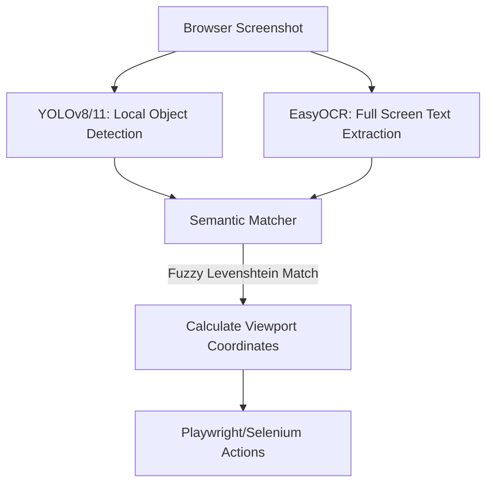

# 👁️ VisiFlow

[](https://pypi.org/project/visiflow/)
[](https://opensource.org/licenses/MIT)
[]()

**VisiFlow** is a fast, local, zero-cloud-dependency visual-driven E2E automation testing plugin for **Playwright** and **Selenium**. 

It challenges traditional web automation by throwing away fragile HTML DOM selectors (XPath, IDs, CSS classes) and replacing them with a local computer vision pipeline (YOLO + EasyOCR) to locate and interact with elements exactly how a human does.

---

## 🚀 Why VisiFlow?

* **Zero-Maintenance Tests**: Say goodbye to broken tests caused by front-end refactoring, CSS changes, or ID updates. If it *looks* like a login button and says "Login", VisiFlow will find it.
* **100% Local & Private**: Runs on your local machine using YOLOv8/11/26 and EasyOCR. No files are uploaded to external APIs, ensuring zero latency, zero cloud costs, and complete privacy.
* **Sub-300ms Inference**: Optimized single-pass screenshot detection matching YOLO boundaries with OCR boxes in milliseconds.
* **Seamless Integration**: Drop-in wrapper that extends your existing Playwright and Selenium suites with a single line of code.

---

## 📦 Installation

```bash
pip install "visiflow[playwright,selenium]"
```

*Note: The first time VisiFlow runs, it will automatically download lightweight local model weights (~60MB total) for YOLO and OCR detection. Subsequent runs will load instantly.*

---

## ⚡ Quick Start

### 🎭 With Playwright

```python
from playwright.sync_api import sync_playwright
from visiflow import VisiPlaywrightPage

with sync_playwright() as p:
    browser = p.chromium.launch()
    page = browser.new_page()
    page.goto("https://example.com/login")

    # Wrap the standard Playwright page
    visipage = VisiPlaywrightPage(page)

    # Automate visually using natural labels!
    visipage.visual_fill("Username", "admin")
    visipage.visual_fill("Password", "secret123")
    visipage.visual_click("Submit")

    # Verify results visually
    if visipage.visual_wait_for("Welcome back!"):
        print("Login Success!")
        
    browser.close()
```

### 🌐 With Selenium

```python
from selenium import webdriver
from visiflow import VisiSeleniumDriver

driver = webdriver.Chrome()
driver.get("https://example.com/login")

# Wrap the standard Selenium webdriver
visidriver = VisiSeleniumDriver(driver)

# Automate visually!
visidriver.visual_fill("Username", "admin")
visidriver.visual_click("Submit")

driver.quit()
```

---

## 🧠 How it Works

VisiFlow processes browser automation in a 3-step pipeline:



1. **Local Object Detection**: A lightweight YOLO model identifies potential clickable boundaries (buttons, inputs, dropdowns) directly from browser screenshots.
2. **Text Anchoring**: Local OCR extracts text labels. If a user requests `"Login"`, fuzzy Levenshtein matching aligns it even if OCR yields minor reading anomalies (like `"Log1n"`).
3. **Smart Click Projection**: The resolved text center is projected into the closest YOLO/OpenCV container bounding box, clicking the exact center of the interactive button.

---

## 🛡️ License

VisiFlow is open-source and licensed under the MIT License.
